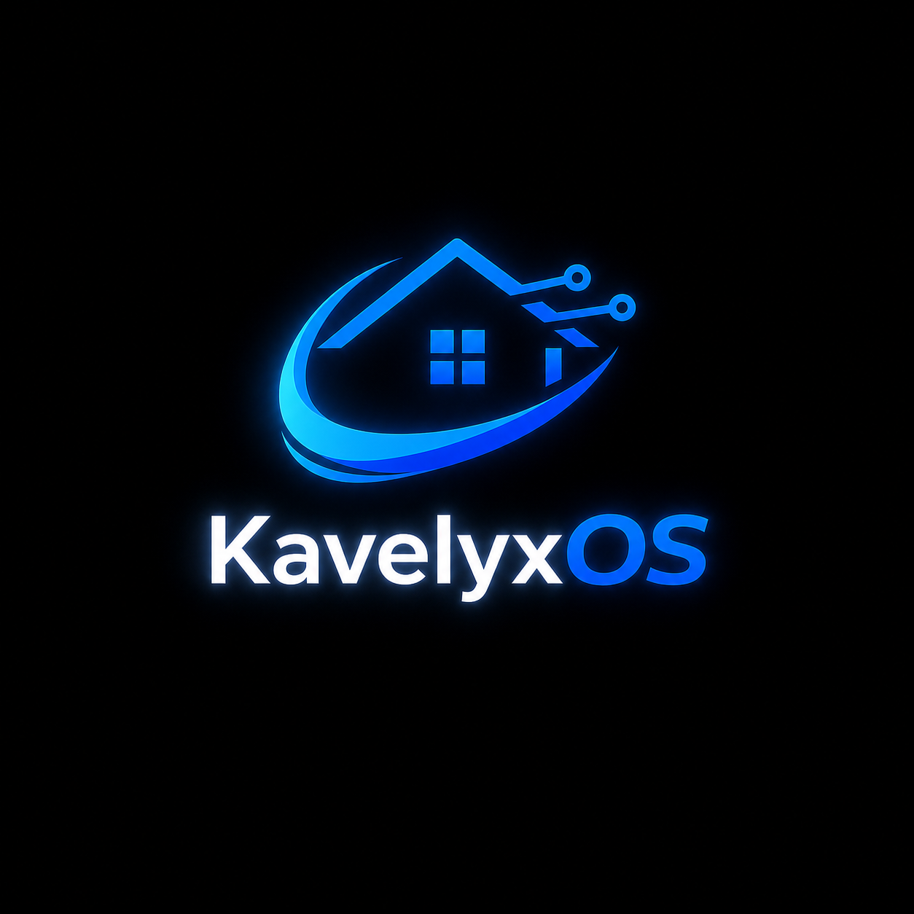

  

# Kavelyx

Kavelyx builds private, local-first software for connected homes and personal servers.

Our work focuses on simple setup, secure device management, local control, and practical automation tools for everyday users.

Most engineering repositories are private while the foundation is being built. Public documentation, SDKs, and release artifacts will appear here when they are ready.
